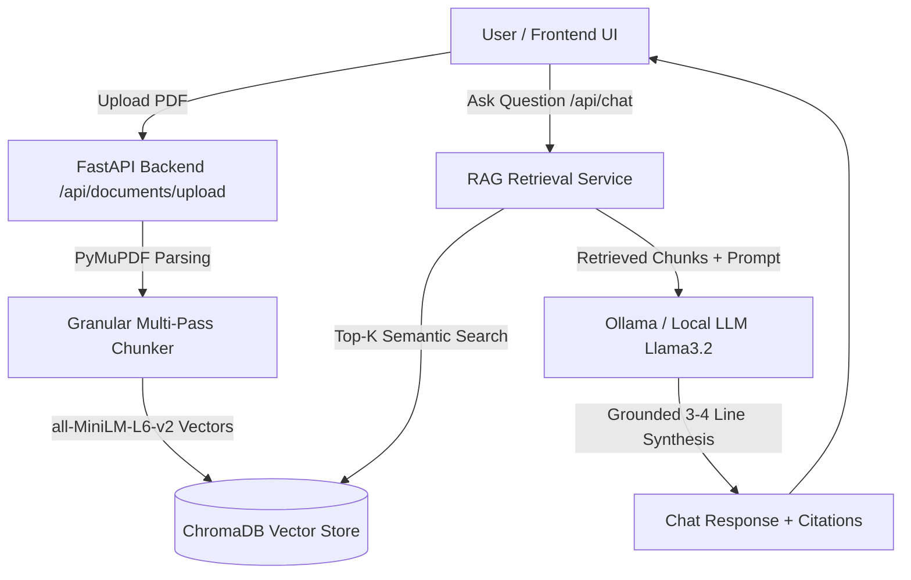

# 🧠 Enterprise RAG AI Knowledge Assistant

An Enterprise Retrieval-Augmented Generation (RAG) Document Assistant built with **Next.js 16 (Turbopack)**, **FastAPI**, **LangChain**, **ChromaDB**, and **Ollama (Llama 3.2)**.

---

## 🌟 Key Features

- 📑 **Intelligent PDF Ingestion & Dynamic Chunking**:
  - Automatic sliding-window chunking guaranteeing granular semantic vectorization across small (min 10 chunks) and large (100+ chunks) PDF documents.
- 🎯 **Grounded Retrieval-Augmented Generation (RAG)**:
  - Vector embeddings powered by `sentence-transformers/all-MiniLM-L6-v2` stored persistently in ChromaDB.
  - Sub-second cosine similarity search matching top relevant chunks.
- 💬 **3-4 Line Grounded Responses with Source Citations**:
  - Synthesizes concise, direct, factual answers paired with verifiable source cards (file name, page number, match percentage).
  - Pinned chat input box with dedicated scrollable conversation history.
- 🇮🇳 **Patriotic Animated Indian Flag (Tiranga) Theme**:
  - Flowing animated Saffron, White, and India Green background mesh with rotating 24-spoke Ashoka Chakra watermark.
  - Indian Flag badges integrated into Home and Dashboard navigation bars.
- 🌤️ **3D Volumetric Drifting Clouds on Home Page**:
  - Atmospheric 60fps canvas-rendered moving clouds with real-time mouse/touch parallax.
- 🔒 **User Authentication & Isolation**:
  - Clerk Authentication with synchronized theme toggles (Dark/Light mode) and conversation isolation.
- 🦙 **Offline Local LLM Fallback (Ollama)**:
  - Powered by local `llama3.2:1b` with fallback grounded extractive synthesis when Ollama is offline.

---

## 🏗️ Architecture Overview



---

## 🚀 Getting Started

### Prerequisites
- **Node.js**: v18+ or v20+
- **Python**: v3.10+ or v3.11+
- **Ollama** (Optional for local inference): [Download Ollama](https://ollama.com)

---

### 1. Backend Setup

```bash
cd backend

# Create virtual environment
python -m venv .venv

# Activate virtual environment
# On Windows:
.venv\Scripts\activate
# On Linux/macOS:
source .venv/bin/activate

# Install dependencies
pip install -r requirements.txt

# Run the FastAPI backend server (Port 8000)
python run_server.py
```

---

### 2. Frontend Setup

```bash
cd frontend

# Install dependencies
npm install

# Run the Next.js development server (Port 3000)
npm run dev
```

Open [http://localhost:3000](http://localhost:3000) in your browser.

---

### 3. Local Ollama LLM (Optional)

Start your local Ollama instance:
```bash
ollama run llama3.2:1b
```
The assistant will automatically detect `http://localhost:11434` and use `llama3.2:1b` for contextual synthesis.

---

## 📁 Repository Structure

```
├── backend/
│   ├── app/
│   │   ├── api/          # FastAPI Routes (chat, documents, conversations)
│   │   ├── core/         # Security, database & middleware
│   │   ├── rag/          # Text extraction & chunking pipeline
│   │   ├── schemas/      # Pydantic validation models
│   │   ├── services/     # RAG, LLM & document services
│   │   └── config.py     # Configuration & environment settings
│   ├── data/             # Uploads & local databases
│   └── run_server.py     # Backend server entrypoint
│
├── frontend/
│   ├── app/              # Next.js App Router (dashboard, auth, home)
│   ├── components/       # UI Components (chat, landing, shared)
│   │   ├── dashboard/    # Chat, file-upload, stats, conversation history
│   │   ├── landing/      # Home page components
│   │   └── shared/       # 3D clouds, Indian flag, theme toggle
│   └── public/           # Static assets
└── README.md
```

---

## 📜 License
MIT License. Built for enterprise knowledge retrieval and document intelligence.
